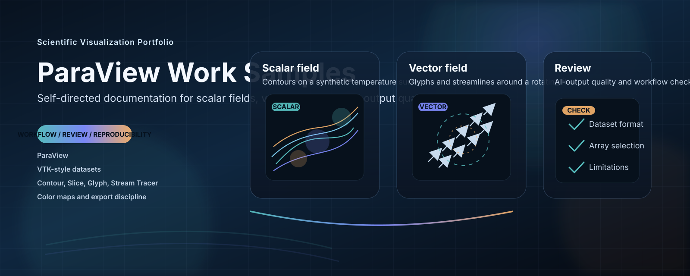
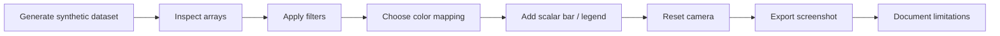

# Scientific Visualization & ParaView Work Samples

<p align="center">
  
</p>

This repository is a self-directed, public work-sample portfolio built to demonstrate practical understanding of ParaView workflows, scientific visualization documentation, and quality review of AI-generated technical instructions.

> Honest scope: these are not client deliverables, lab reports, or production simulation studies.
> They are intentionally synthetic examples created to show workflow reasoning, reproducibility habits, and visual communication skill.

## What This Repository Covers

| Area | What It Demonstrates |
| --- | --- |
| ParaView workflow documentation | Clear, step-by-step visualization procedures that can be repeated and reviewed |
| VTK-style datasets | Simple structured scalar and vector fields suitable for ParaView inspection |
| Scientific visualization pipelines | Filter ordering, array selection, color mapping, and export discipline |
| Scalar fields | Contour and slice interpretation on a synthetic temperature field |
| Vector fields | Glyph and stream-tracer reasoning on a synthetic flow field |
| AI instruction review | Evaluation of generated ParaView guidance for clarity, correctness, and missing assumptions |

## Visual Identity

The visual style is intentionally sharp and technical:

- a dark scientific-graphics palette
- contour and vector motifs in the banner art
- compact workflow cards and checklists
- readable, job-application-friendly documentation
- explicit limitations so the visuals never outrun the evidence

## Core Concepts Referenced

- ParaView
- VTK-style datasets
- Scientific visualization pipelines
- Scalar fields
- Vector fields
- Contour, Slice, Clip, Glyph, Stream Tracer, and Calculator filters
- Color maps
- Screenshot and export workflows
- AI-generated ParaView instruction evaluation

## Workflow At A Glance



## Skills Demonstrated

- Scientific visualization workflow documentation
- Dataset inspection
- Filter and pipeline reasoning
- Scalar and vector field interpretation
- Reproducible technical documentation
- Quality review of AI-generated visualization instructions
- Attention to assumptions, edge cases, and scope limits

## Project Map

| Project | Focus | Key Files |
| --- | --- | --- |
| [01. Volume & Contour Visualization](projects/01-volume-contour-visualization/README.md) | Scalar field slicing, contouring, and export discipline | [workflow](projects/01-volume-contour-visualization/workflow.md), [pipeline notes](projects/01-volume-contour-visualization/pipeline-notes.md), [expected outputs](projects/01-volume-contour-visualization/expected-outputs.md), [quality checklist](projects/01-volume-contour-visualization/quality-checklist.md) |
| [02. Vector Field & Flow Visualization](projects/02-vector-field-flow-visualization/README.md) | Glyphs, flow interpretation, and vector-field review | [workflow](projects/02-vector-field-flow-visualization/workflow.md), [vector field notes](projects/02-vector-field-flow-visualization/vector-field-notes.md), [expected outputs](projects/02-vector-field-flow-visualization/expected-outputs.md), [quality checklist](projects/02-vector-field-flow-visualization/quality-checklist.md) |
| [03. ParaView AI Output Quality Review](projects/03-paraview-ai-output-quality-review/README.md) | Evaluating a flawed AI-generated ParaView answer and rewriting it clearly | [fake answer](projects/03-paraview-ai-output-quality-review/fake-ai-generated-answer.md), [review findings](projects/03-paraview-ai-output-quality-review/review-findings.md), [improved answer](projects/03-paraview-ai-output-quality-review/improved-answer.md), [evaluation checklist](projects/03-paraview-ai-output-quality-review/evaluation-checklist.md) |

## Snapshot

| Theme | Evidence |
| --- | --- |
| Scalar workflows | Slice, contour, color mapping, scalar bars, export discipline |
| Vector workflows | Glyphs, magnitude scaling, stream tracers, flow interpretation |
| AI review | Missing assumptions, unclear datasets, and overclaim detection |
| Documentation quality | Reproducible notes, limitation statements, and clear claims |

## Why This Matters For AI Research And Digital Asset Evaluation

Scientific visualization instructions are easy to make sound convincing while still missing the details that matter: dataset format, array selection, filter sequence, reproducibility, and limitations. This portfolio demonstrates how I review technical content for those failure modes and rewrite it into a workflow that is testable, honest, and reusable.

That same discipline is useful when evaluating AI-generated technical content or digital assets:

- verify the data model before trusting the explanation
- check whether the pipeline can be reproduced from the instructions alone
- separate visual appearance from scientific meaning
- record what the visualization supports and what it does not
- avoid overstated conclusions that the dataset cannot justify

## Repository Link

- GitHub: https://github.com/YOUR_USERNAME

## Repository Layout

```text
paraview-scientific-visualization-work-samples/
  assets/
  README.md
  projects/
  scripts/
  docs/
  LICENSE
  .gitignore
```
