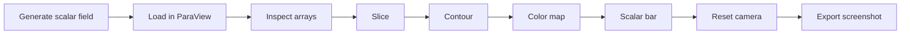

# Volume & Contour Visualization - ParaView Workflow Sample

This sample documents a basic scalar-field visualization pipeline in ParaView using a synthetic dataset generated from a simple mathematical function. It is intended to show disciplined workflow thinking rather than physical simulation claims.

## Objective

Show how to inspect a scalar field, isolate a 2D section with `Slice`, extract isovalues with `Contour`, and present the result with an explicit color map and export step.

## Dataset

- Source: `scripts/generate_sample_scalar_field.py`
- Default output: `generated-data/scalar_field.vtk`
- Field: `temperature = sin(x) * cos(y) + z`
- Type: synthetic structured scalar field

## Workflow At A Glance

## Expected Result

The result should be a clearly labeled slice through the volume with contour lines or isosurfaces derived from the selected scalar array. Color should vary smoothly across the scalar range, and the scalar bar should identify the variable being shown.

## Limitations

- The dataset is synthetic, so the visualization does not represent a measured or simulated physical system.
- Contour levels show mathematical thresholds, not inherently meaningful scientific events.
- The visual interpretation depends on the chosen slice orientation, contour values, and color map.

## Related Files

- [Workflow notes](workflow.md)
- [Pipeline notes](pipeline-notes.md)
- [Expected outputs](expected-outputs.md)
- [Quality checklist](quality-checklist.md)

