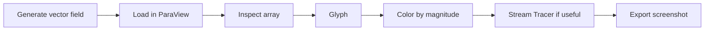

# Vector Field & Flow Visualization - ParaView Workflow Sample

This sample documents how to review a synthetic vector field in ParaView using glyphs and, when appropriate, stream tracing. The emphasis is on clear interpretation and careful wording, not on claiming real CFD or experimental results.

## Objective

Show how to inspect a vector array, visualize direction and magnitude with `Glyph`, and describe flow behavior without overstating the meaning of the synthetic field.

## Dataset

- Source: `scripts/generate_sample_vector_field.py`
- Default output: `generated-data/vector_field.vtk`
- Field:
  - `vx = -y`
  - `vy = x`
  - `vz = 0.1 * z`
- Type: synthetic vector field on a structured grid

## Scalar Field Versus Vector Field

| Scalar Field | Vector Field |
| --- | --- |
| One value per sample location | Three directional components per sample location |
| Good for contours, slices, and thresholding | Good for glyphs, streamlines, and direction-aware color mapping |
| Example: temperature | Example: velocity or flow direction |

## Workflow At A Glance

## Expected Result

The render should make direction, magnitude, and pattern visible without pretending the synthetic field is a measured flow case. Glyphs should point in a coherent rotational pattern, and any streamlines should follow the same general structure.

## Limitations

- The dataset is synthetic and idealized.
- Glyph density can make the render look busier than the data really is.
- Stream tracers are visually helpful but do not create scientific meaning by themselves.

## Related Files

- [Workflow notes](workflow.md)
- [Vector field notes](vector-field-notes.md)
- [Expected outputs](expected-outputs.md)
- [Quality checklist](quality-checklist.md)

