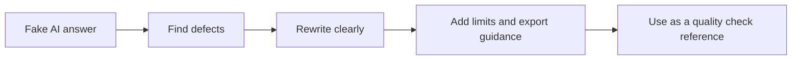

# ParaView AI Output Quality Review - Sample

This sample shows how I evaluate an AI-generated ParaView answer for correctness, missing assumptions, and reproducibility. The goal is to turn a plausible-sounding response into a workflow that can actually be followed and reviewed.

## Objective

Demonstrate a practical review process for AI-generated visualization instructions:

- identify unclear dataset assumptions
- check whether the filter order is valid
- confirm whether arrays and color mapping are specified
- ensure export and reproducibility details are present
- rewrite the answer so it is precise and honest

## Review Flow

## Related Files

- [Fake AI-generated answer](fake-ai-generated-answer.md)
- [Review findings](review-findings.md)
- [Improved answer](improved-answer.md)
- [Evaluation checklist](evaluation-checklist.md)

